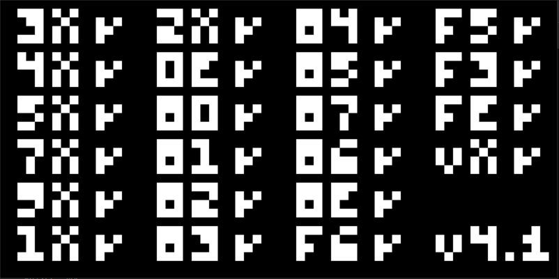
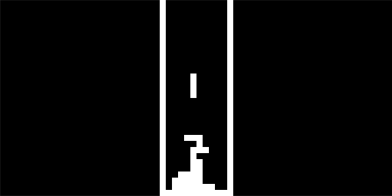

# Cheap8emu

CHIP-8 interpreter written in C++ as a personal introduction to hardware emulation.

> CHIP-8 is an interpreted programming language, developed by Joseph Weisbecker on his 1802 microprocessor. It was initially used on the COSMAC VIP and Telmac 1800, which were 8-bit microcomputers made in the mid-1970s. [Learn more](https://en.wikipedia.org/wiki/CHIP-8).

## Screenshots
The interpreter successfully passes opcode tests 

  

Using SDL for input-handling and rendering, the interpreter executes ROMs from the 1970s-1990s  

  

## Resources Used
- [Cowgod's Chip-8 Technical Reference](http://devernay.free.fr/hacks/chip8/C8TECH10.HTM#2.4)
- [Austin Morlan's CHIP-8 Emulator Guide](https://austinmorlan.com/posts/chip8_emulator/)
- [Tobias V. Langhoff's Blog on Writing a CHIP-8 Emulator](https://tobiasvl.github.io/blog/write-a-chip-8-emulator/)
- [Su Po's Chip8 Test Suite on CodeSandbox](https://codesandbox.io/p/github/su-po/chip8-test-suite/main)
- [kripod's CHIP-8 ROMs](https://github.com/kripod/chip8-roms)
